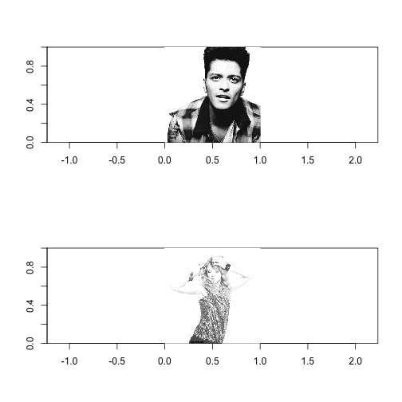
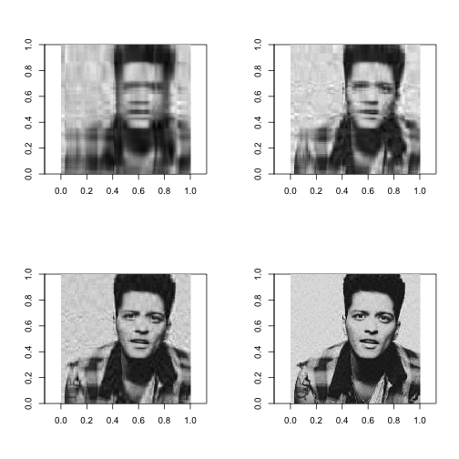
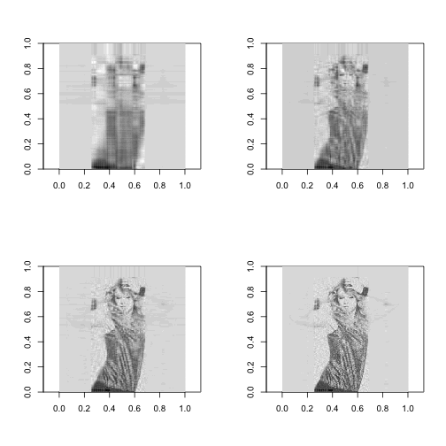

Picture Compression and Recovery
========================================================
transition: rotate
css: custom.css

author: Zhoutong Fu  
date: Thu Jun 18 18:31:26 2015

Overview
========================================================
type: section
The purpose of this presentation is to provide a overview and a simple guide for the shiny app **Playing with Picture Compressions** that I created as part of course project for *developing data products*  

I've applied Singular Value Decomposition to compress and store images and tried to recover compressed ones with their components.

- What is Singular Value Decomposition (SVD)
- Examples from **Playing with Picture Compressions**

SVD for Image
========================================================
type: section

Represented as matrix, an image could be factorized via SVD into three parts: left-singular vectors, singular values and right-singular values whose sizes are much smaller so that as to achieve tremendous compression. [wiki link to SVD](https://en.wikipedia.org/wiki/Singular_value_decomposition)

Multiplying the three parts we could recover the original image. However, as a purpose to further compress image, we could abandon more data and only store the top components from SVD, sacrifysing a little on the **quality** of recovered images.

My simple shiny app illustrates the relationship between the number of top components used and the quality of the recovered image. I will walk through some examples in the next two slides.  

A walk through (1)
========================================================
type: alert
left: 50%

There are 3 default pictures for users to choose: Taylor Swifty, Bruno Mars and Steve Curry. 

On the right hand side are the original pictures and for simplicity they black/white.

Users are also provided with a slider bar to pick the number of components desired. The next slide shows some recovered pictures with components 5, 10 20 and 40 of Bruno Mars and Taylor Swift.

***

 

A walk through (2)
========================================================
type: alert

 

*** 
 

